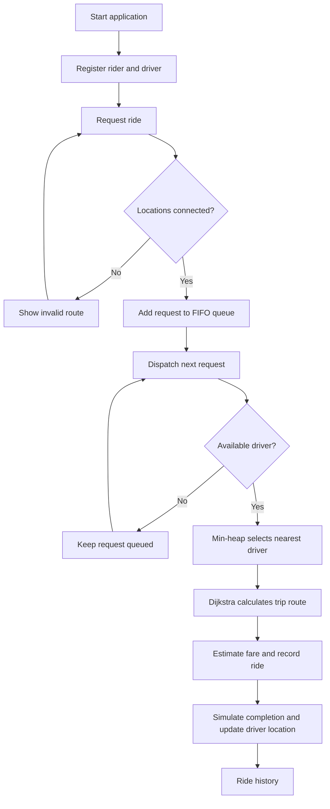
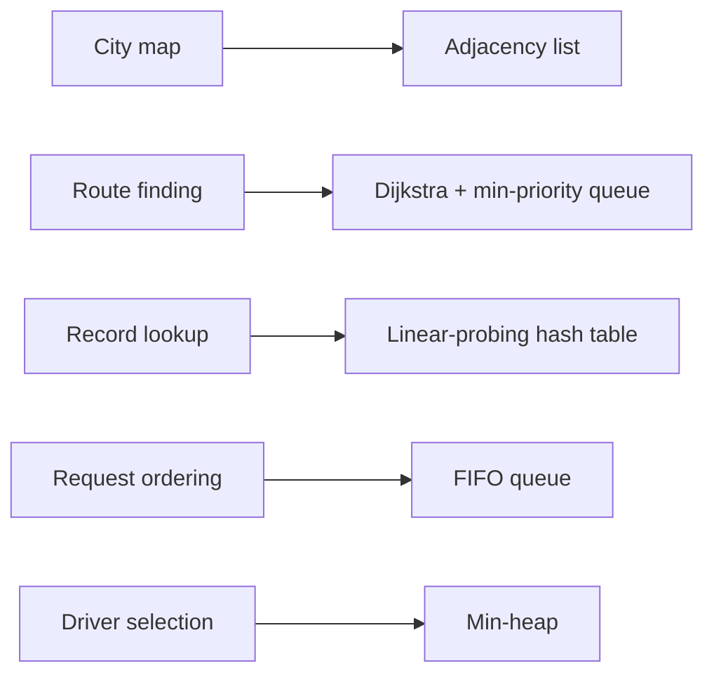

<div align="center">

# 🏍️ Smart Bike Taxi Platform

### A C++17 data-structures-and-algorithms project

A console-based ride-booking simulation featuring shortest-path routing, FIFO requests, nearest-driver matching, and fare estimation.


</div>

---

## 🚦 How it works

The application models a small, illustrative Noida road network. A rider is registered, submits a request, and the system finds a route and matches the request with an available driver.



## ✨ Features

| Feature | What it does |
| --- | --- |
| 🗺️ Road network | Weighted, undirected graph representing sample Noida locations |
| 📍 Route planning | Dijkstra's algorithm returns the shortest path and distance |
| 🙋 Rider registration | Stores rider records in a custom hash table |
| 🛵 Driver registration | Stores drivers, starting locations, and availability |
| 🧾 Ride requests | FIFO queue preserves request arrival order |
| ⚡ Driver matching | Min-priority queue selects an available driver with the shortest route to pickup |
| 💰 Fare estimate | Sample formula: ₹20 base fare + ₹10 per km |
| 🧹 Cancellation | Cancels a pending request by its request ID |
| 📋 Ride history | Lists rides completed in the current run |
| 👥 Driver listing | Shows each registered driver's location and availability |

## 🧠 DSA concepts demonstrated



| Problem | Structure / algorithm | Typical complexity |
| --- | --- | --- |
| Store roads | Adjacency list | Space: O(V + E) |
| Find shortest route | Dijkstra with binary heap | O((V + E) log V) |
| Find rider/driver by ID | Linear-probing hash table | Average O(1), worst O(n) |
| Preserve request order | FIFO queue | Enqueue/dequeue O(1) |
| Select nearest available driver | Min-heap | Insert/remove O(log D) |

Here, **V** is the number of locations, **E** is the number of roads, and **D** is the number of candidate drivers.

## 🧰 Tech stack

- **Language:** C++17
- **Core concepts:** Graphs, Dijkstra's algorithm, hash tables, queues, heaps
- **Build:** g++
- **Automated checks:** GitHub Actions

## ▶️ Build and run

You need a C++17-compatible compiler such as g++.

### Windows (MinGW / PowerShell)

Run these commands from the repository folder:

```powershell
g++ -std=c++17 -Wall -Wextra -pedantic main.cpp -o smart_bike_taxi.exe
.\smart_bike_taxi.exe
```

### Linux / macOS

```bash
g++ -std=c++17 -Wall -Wextra -pedantic main.cpp -o smart_bike_taxi
./smart_bike_taxi
```

Choose an option from the menu. Enter location names exactly as displayed by **Show locations**.

## 🧪 Run tests

The test program checks graph creation, shortest-path distance and path reconstruction, invalid routes/roads, and hash-table insert, lookup, and update behavior.

### Windows

```powershell
g++ -std=c++17 -Wall -Wextra -pedantic tests.cpp -o tests.exe
.\tests.exe
```

### Linux / macOS

```bash
g++ -std=c++17 -Wall -Wextra -pedantic tests.cpp -o tests
./tests
```

A GitHub Actions workflow is configured to compile the application and tests with warnings treated as errors, then run the tests on pushes and pull requests to `main`.

## 🗂️ Project structure

```text
.
├── .github/
│   └── workflows/
│       └── cpp.yml          # Build and test workflow
├── graph/
│   └── Graph.h              # Adjacency-list graph and Dijkstra
├── models/
│   └── Models.h             # Rider, driver, request, and ride models
├── structures/
│   └── HashTable.h          # Custom linear-probing hash table
├── main.cpp                 # Interactive console application
├── tests.cpp                # Graph and hash-table assertions
└── README.md
```

## 🗺️ Sample map

The built-in demonstration network contains these locations:

- JIIT 128
- Sector 62
- Botanical Garden
- Noida City Centre
- Sector 18

Road distances are illustrative values defined in `main.cpp`; they are not live or official road measurements.

## ⚠️ Scope and limitations

This repository is an **academic simulation**, not a production ride-hailing service.

- All rider, driver, request, and ride data is held in memory and is lost when the program exits.
- The map and distances are sample data; there is no live map or traffic integration.
- Phone numbers are demo inputs only. There is no OTP or identity verification.
- Dispatch and ride completion are simulated immediately; there is no live driver tracking.
- There is no payment processing, backend, or persistent database.

## 🔭 Possible next steps

- Persist riders, drivers, and ride history between sessions.
- Add driver availability controls and more dispatch scenarios.
- Expand automated tests to cover queue cancellation and dispatch behavior.
- Replace the sample map with a configurable dataset.

## 👨‍💻 Repository

**GitHub:** [coolbandariya/Smart_bike_taxi_platform](https://github.com/coolbandariya/Smart_bike_taxi_platform)

---

<div align="center">
Built as a C++17 DSA academic project.
</div>


## Recent improvements

- Added a console menu option to manually toggle a driver's availability.
- Hardened road creation to reject infinite and NaN distances.
- Expanded tests for invalid road weights, zero-distance roads, empty hash keys, and full hash tables.

Persistence is still a future improvement; all records currently exist only for the current program session.
