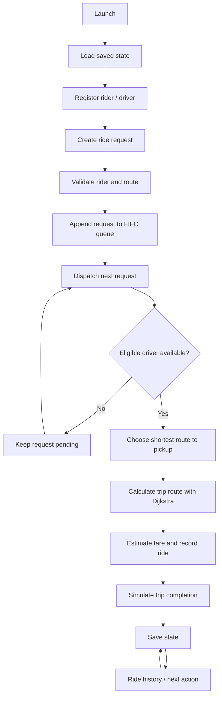

<div align="center">

# 🏍️ Smart Bike Taxi Platform

**A modular C++17 ride-booking simulation built around data structures and algorithms.**

Shortest-path routing · FIFO ride requests · Nearest-driver dispatch · Local persistence


</div>

---

## Overview

Smart Bike Taxi Platform is an interactive terminal application that demonstrates how core DSA concepts can support a simplified ride-hailing workflow. It uses a small, illustrative Noida road network and lets users register riders and drivers, request and cancel rides, dispatch requests, estimate fares, and review ride history.

> This is an academic simulation. It does not connect to real riders, drivers, maps, traffic, or payment services.

## Workflow



## Features

| Feature | Description |
| --- | --- |
| Road network | Weighted, undirected graph with sample Noida locations |
| Route planning | Dijkstra shortest path with route reconstruction |
| Rider and driver records | Custom linear-probing hash table |
| Request management | FIFO queue, pending count, and cancellation by request ID |
| Driver matching | Min-priority queue selects the available driver with the shortest route to pickup |
| Driver controls | List drivers and toggle availability |\n| Ride lifecycle | Assigned → in progress → completed; driver is released only on completion |
| Fare estimate | Sample formula: ₹20 base + ₹10 per km |
| Ride history | Records simulated completed rides |
| Persistence | Saves riders, drivers, pending requests, history, and ID counters to a local file |
| Automated checks | GitHub Actions compiles the app and tests with warnings treated as errors |

## DSA concepts

| Use case | Implementation | Complexity |
| --- | --- | --- |
| Road network | Adjacency list | O(V + E) space |
| Shortest path | Dijkstra with binary heap | O((V + E) log V) |
| Record lookup | Linear-probing hash table | Average O(1), worst O(n) |
| Request order | FIFO queue | O(1) enqueue/dequeue |
| Driver candidate selection | Min-heap | O(log D) per insertion/removal |

V = locations, E = roads, D = eligible drivers. Hash table performance depends on load factor and collisions.

## Project structure

```text
.
├── .github/workflows/cpp.yml  # GCC, Clang, and sanitizer CI
├── CMakeLists.txt             # Portable build and CTest configuration
├── graph/Graph.h              # Graph and Dijkstra
├── models/Models.h            # Rider, driver, request, ride models
├── storage/Storage.h          # Versioned local save/load
├── structures/HashTable.h     # Linear-probing hash table
├── main.cpp                   # Interactive application
├── tests.cpp                  # Unit and persistence tests
└── README.md
```

## Requirements

- C++17-compatible compiler (g++ recommended)
- Terminal / PowerShell

## Build and run

Run from the repository root. CMake is the recommended cross-platform build path.

**CMake (Windows, Linux, macOS)**

```bash
cmake -S . -B build
cmake --build build --parallel
```

Run the generated `smart_bike_taxi` (or `smart_bike_taxi.exe` on Windows) from the build directory. The application stores its data in the current working directory.

**Windows (MinGW / PowerShell, direct compiler)**

```powershell
g++ -std=c++17 -Wall -Wextra -Wpedantic main.cpp -o smart_bike_taxi.exe
.\smart_bike_taxi.exe
```

**Linux / macOS (direct compiler)**

```bash
g++ -std=c++17 -Wall -Wextra -Wpedantic main.cpp -o smart_bike_taxi
./smart_bike_taxi
```

### Menu

| Option | Action |
| ---: | --- |
| 1 | Show locations |
| 2 | Register rider |
| 3 | Register driver |
| 4 | Request a ride |
| 5 | Dispatch next request |
| 6 | Show ride history |
| 7 | Show pending request count |
| 8 | Cancel a pending request |
| 9 | Show drivers |
| 10 | Toggle driver availability |
| 0 | Exit |

Enter location names exactly as listed by **Show locations**.

## Run tests

**Windows**

```powershell
g++ -std=c++17 -Wall -Wextra -Wpedantic tests.cpp -o tests.exe
.\tests.exe
```

**Linux / macOS**

```bash
g++ -std=c++17 -Wall -Wextra -Wpedantic tests.cpp -o tests
./tests
```

Tests cover graph and hash-table behavior, invalid road weights, persistence save/load, malformed-file rejection without partial mutation, driver dispatch selection, ride lifecycle transitions, and rejection of zero-length ride requests. GitHub Actions builds with GCC and Clang and runs the tests; a separate job enables AddressSanitizer and UndefinedBehaviorSanitizer. Run locally with `cmake -S . -B build`, `cmake --build build --parallel`, then `ctest --test-dir build --output-on-failure`.

## Local data

The application writes `smart_bike_taxi_data.txt` in the current working directory and saves after each menu action. Keep this file in the same directory when restarting the application to restore the demo state.

- The file is local, plain-text demo storage—not encrypted or suitable for sensitive personal information.
- Do not enter real phone numbers or other private information.
- The file is excluded from Git by `.gitignore`.
- The save format is versioned; incompatible or malformed data causes startup to stop with an error rather than silently overwrite it.

## Sample map and fare

The built-in map includes JIIT 128, Sector 62, Botanical Garden, Noida City Centre, and Sector 18. Distances are illustrative values defined in the source, not official road distances.

Fare estimate = ₹20 + (shortest trip distance in km × ₹10). This is a demonstration formula, not a real-world fare quote.

## Limitations

- Dispatch, ride start, and trip completion are synchronous simulations; the operator manually advances ride states.
- No live GPS, map provider, traffic data, OTP, authentication, database server, payment gateway, or buyer/operator network is connected.
- The local data file is intended for a single-user demo and has no concurrent-write protection.
- The custom hash table has a fixed capacity of 101 records per table; when full, new records are rejected.
- Saves write a temporary snapshot and retain the previous snapshot as a backup during replacement; sudden power loss and filesystem-specific rename behavior can still affect recovery.

## Further development

Possible extensions include a configurable map, a larger/resizing hash table, broader dispatch/cancellation integration tests, cancellation of already-assigned rides, and a real backend. Production use would also require authentication, privacy controls, secure storage, operational monitoring, and real service integrations.

---

<div align="center">

Built as a C++17 DSA academic project.

**[View repository](https://github.com/coolbandariya/Smart_bike_taxi_platform)**

</div>
